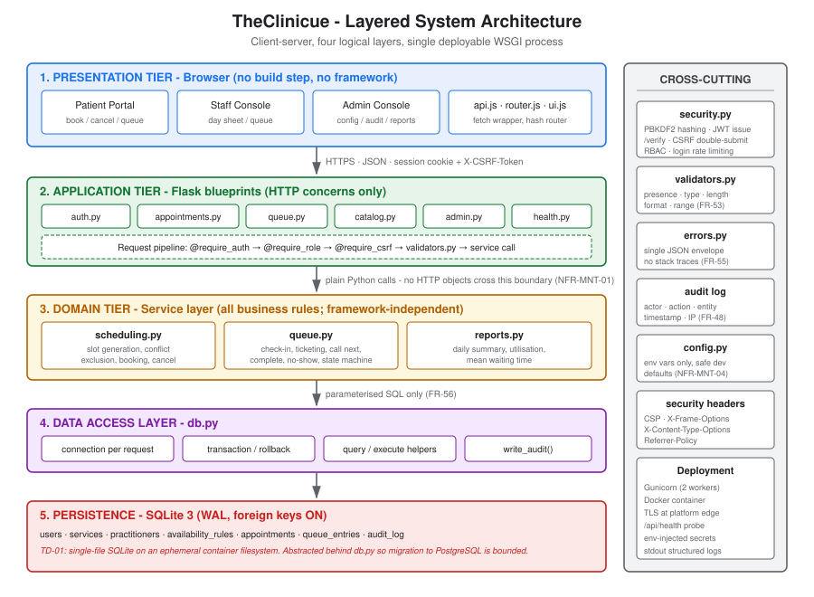
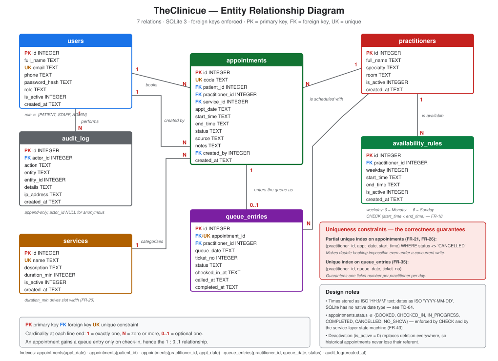
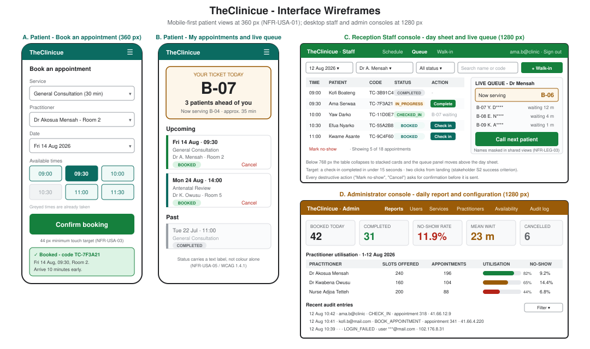
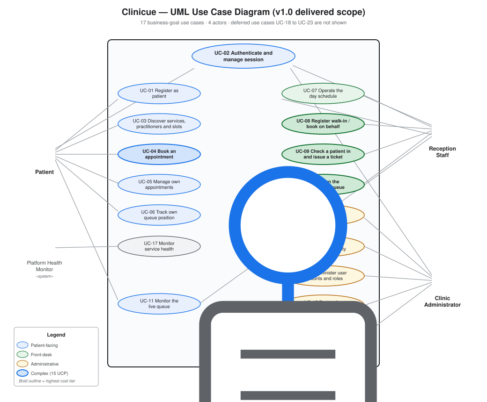
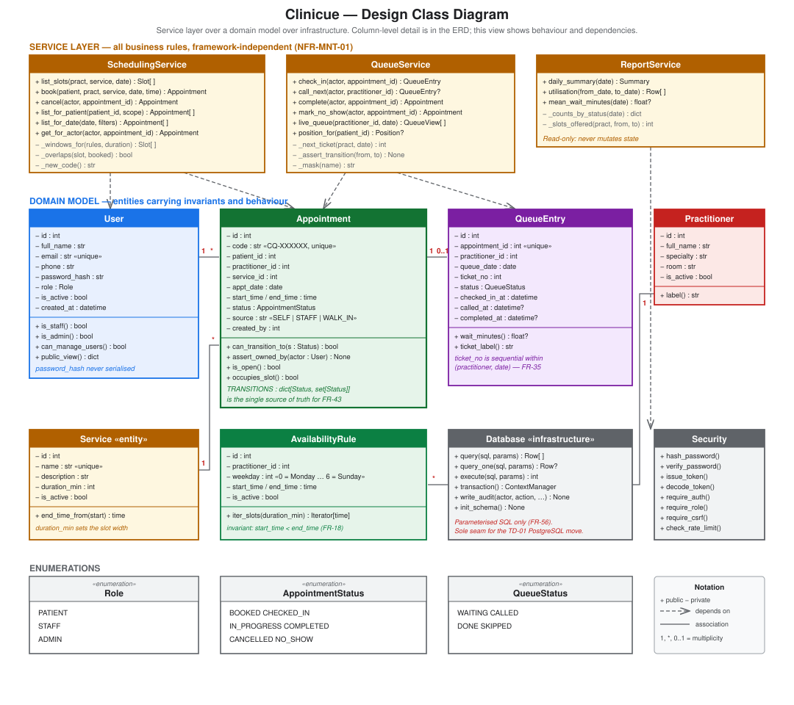
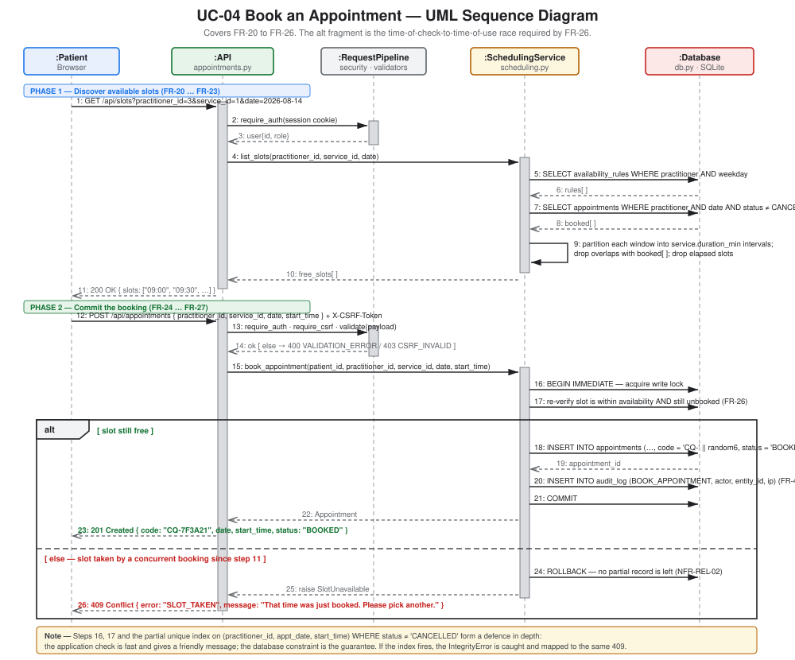
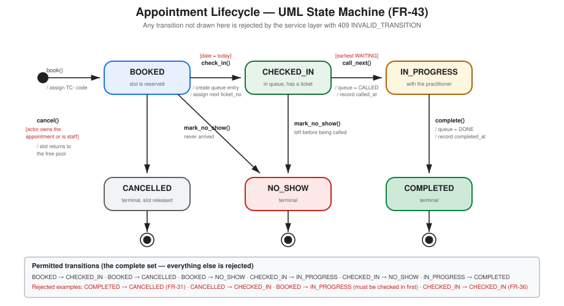
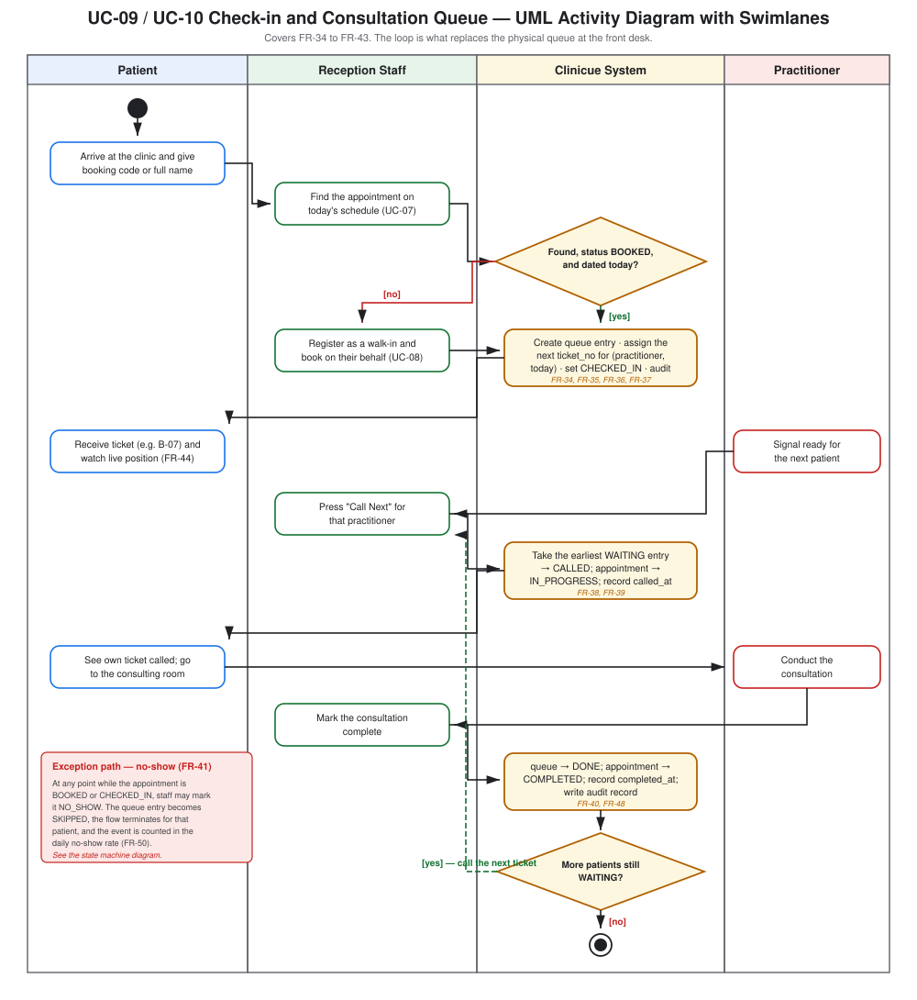

# System Analysis and Design

## TheClinicue: Outpatient Appointment & Queue Management System

**Document version:** 1.0
**Phase:** 2 (Analysis & Design), hours 7-12
**Author:** [STUDENT NAME]

---

## 1. Analysis

### 1.1 As-is process analysis

The existing manual outpatient process was modelled before any design decision was taken. Each step was classified as **automate**, **support** or **leave alone**; the classification is what fixes the system boundary.

| # | As-is step | Current cost | Classification | Design response |
|---|---|---|---|---|
| 1 | Patient decides to seek care | - | Leave alone | Outside the system. |
| 2 | Patient travels to the clinic, not knowing whether a clinician is free | Wasted journeys; care avoidance | **Automate** | Slot discovery and booking before travel (UC-03, UC-04). |
| 3 | Patient joins an undifferentiated physical queue | 3-5 h waits; disputes | **Automate** | Scheduled slots plus a digital ticketed queue (UC-09, UC-10). |
| 4 | Reception arbitrates queue order manually | Staff time; conflict | **Automate** | Deterministic ticket ordering by check-in time (FR-35, FR-38). |
| 5 | Reception locates the patient's paper record | Staff time | **Leave alone** | Records are out of scope (C-06). TheClinicue holds no clinical data. |
| 6 | Practitioner calls the next patient by shouting a name | Noise; missed calls; privacy loss | **Automate** | Ticket-number call with a shared live queue view (UC-11, NFR-LEG-03). |
| 7 | Consultation | - | **Leave alone** | Clinical act; outside the boundary. |
| 8 | Practitioner writes clinical notes | - | **Leave alone** | EMR territory; deliberately excluded. |
| 9 | Patient leaves; no record of attendance is kept | No management data | **Automate** | Lifecycle timestamps and reporting (UC-16, FR-50 to FR-52). |
| 10 | Manager estimates attendance from memory | Bad staffing decisions | **Automate** | Daily summary and utilisation reports. |
| 11 | Dispensing, billing, referral | - | **Leave alone** | Separate regulated domains. |

Six steps are automated, five are left alone. The boundary that falls out of this table is exactly the boundary drawn in SRS §1.2: **TheClinicue manages the patient's journey up to the consulting room door and the record that they walked through it - nothing inside the room.**

### 1.2 Domain analysis: the two hard problems

Most of the system is conventional CRUD. Analysis identified two areas that carry essentially all of the intellectual risk, and the architecture is shaped around isolating them.

**Problem 1 - Deriving bookable slots.** Availability is stored as *recurring rules*, but booking happens against *concrete intervals on a concrete date*. The transformation between the two is the core algorithm:

```
slots(practitioner, service, date) =
      { intervals of length service.duration_min tiled across each
        availability window for date.weekday }
    − { intervals overlapping a non-cancelled appointment on that date }
    − { intervals already elapsed }
```

The analysis decision was to make this a **pure function** of `(rules, booked, duration, date, now)`, with no database or HTTP dependency. That makes it exhaustively unit-testable in isolation, which is why it could be built and proven first (SRS §8.4).

**Problem 2 - Concurrent booking.** Two patients can legitimately be shown the same free slot and both submit. Analysis rejected optimistic display-time locking (it strands slots when users abandon a form) in favour of **last-moment re-verification inside a write transaction, backed by a database uniqueness constraint**. The application check produces a friendly message; the constraint provides the actual guarantee. Both are implemented, because either alone is insufficient: the check alone races, and the constraint alone yields an unfriendly error.

### 1.3 Data analysis

Normalisation was carried to third normal form and stopped there:

- **1NF** - no repeating groups; availability windows are rows, not comma-separated strings.
- **2NF** - no partial dependencies; all tables use a single surrogate key.
- **3NF** - no transitive dependencies. In particular `appointments.end_time` is *derived* from `start_time + service.duration_min`, which is technically a violation. It is stored deliberately: a service's duration may be edited later, and a historical appointment must retain the times it was actually booked for. This is a documented, justified denormalisation, not an oversight.

Deletion is modelled as deactivation (`is_active = 0`) throughout. A service or practitioner that has been used in a historical appointment must never disappear, or reporting silently breaks.

---

## 2. Architecture



### 2.1 Architectural style

TheClinicue uses a **layered (n-tier) architecture** deployed as a **client-server** application in a single process.

| Layer | Responsibility | Rule enforced |
|---|---|---|
| 1. Presentation (browser) | Rendering, input capture, client-side routing | Holds no authority; every role check is presentation only. |
| 2. Application (Flask blueprints) | HTTP concerns: routing, auth decorators, serialisation, status codes | Contains no business rules. |
| 3. Domain (service layer) | All business rules, invariants, state machine | Never imports Flask; receives and returns plain Python values. |
| 4. Data access (`db.py`) | Connections, transactions, parameterised SQL, audit writes | The only module that knows SQLite exists. |
| 5. Persistence (SQLite) | Storage, referential integrity, uniqueness constraints | Last line of defence for correctness. |

### 2.2 Why this style

Three alternatives were considered:

- **Microservices** - rejected outright. Seven entities and one deployment target; the operational overhead would exceed the entire project budget, and distributed transactions would make FR-26 dramatically harder rather than easier.
- **Server-rendered MVC (Flask + Jinja templates)** - genuinely viable and slightly cheaper to build. Rejected because the live queue requires frequent partial refreshes, which is awkward in a full-page-render model on a low-bandwidth connection, and because a JSON API is the seam through which the deferred waiting-room display (FR-62) and any future mobile client arrive.
- **Layered SPA over a REST API** - selected. It keeps the domain layer free of framework and transport concerns, which is what makes NFR-MNT-01 and NFR-MNT-02 achievable.

### 2.3 The load-bearing architectural rule

**No Flask object crosses the boundary into the domain layer, and no SQL appears above the data access layer.**

This single rule is what delivers most of the quality attributes claimed in this project:

- Service-layer logic is testable without spinning up a web request, which is how 80% coverage is reached inside the testing budget (NFR-MNT-02).
- SQLite is confined to one module, which converts TD-01 (the PostgreSQL migration) from a rewrite into a bounded change.
- The state machine lives in exactly one place, so FR-43 cannot be circumvented by adding a new endpoint.

### 2.4 Technology stack and justification

| Concern | Choice | Why this, and what was rejected |
|---|---|---|
| Language | Python 3.11+ | Developer fluency (ECF E8); rich standard library; SQLite bundled. |
| Web framework | Flask 3 | Minimal, unopinionated, well understood. **Django rejected**: its ORM, admin and migrations are leverage for a large system but impose a project structure and learning surface disproportionate to 17 use cases. **FastAPI rejected**: excellent, but its advantages (async, automatic OpenAPI) address problems this system does not have. |
| Datastore | SQLite 3 | Zero-configuration, zero-cost, transactional, bundled. **PostgreSQL rejected for v1.0** solely on constraint C-02 (no budget for a managed instance). Recorded as **TD-01**. |
| Data access | Standard-library `sqlite3` behind a thin DAL | **SQLAlchemy rejected** - the ORM plus migration tooling was costed at 1.5 h of the 7.6 h that had to be found (mitigation M2). Records **TD-02**. |
| Password hashing | Werkzeug PBKDF2-HMAC-SHA256, 600,000 iterations | Already present as a Flask dependency. **Argon2id rejected** on build-chain cost (mitigation M3); recorded as **TD-06**. |
| Session | JWT in an HttpOnly cookie | Stateless, survives worker restarts, no session store needed. See §5.2 for why a cookie rather than `localStorage`. |
| Frontend | Hand-written HTML, CSS and ES2020 modules - no framework, no build step | **React/Vue rejected** on mitigation M1: a toolchain would cost 2 h of budget and add ~40 KB minimum payload against a 150 KB total budget (NFR-PER-03) on 3G connections. Records **TD-05**. |
| Production server | Gunicorn | Standard, battle-tested WSGI server. |
| Testing | pytest with Flask's test client | Fixtures make integration tests cheap; coverage tooling included. |

Every rejection above is a real trade-off with a recorded cost, not a preference.

---

## 3. Database Design



### 3.1 Schema (authoritative DDL)

```sql
PRAGMA foreign_keys = ON;
PRAGMA journal_mode = WAL;

CREATE TABLE users (
    id            INTEGER PRIMARY KEY AUTOINCREMENT,
    full_name     TEXT    NOT NULL,
    email         TEXT    NOT NULL UNIQUE COLLATE NOCASE,
    phone         TEXT    NOT NULL DEFAULT '',
    password_hash TEXT    NOT NULL,
    role          TEXT    NOT NULL DEFAULT 'PATIENT'
                          CHECK (role IN ('PATIENT','STAFF','ADMIN')),
    is_active     INTEGER NOT NULL DEFAULT 1 CHECK (is_active IN (0,1)),
    created_at    TEXT    NOT NULL
);

CREATE TABLE services (
    id           INTEGER PRIMARY KEY AUTOINCREMENT,
    name         TEXT    NOT NULL UNIQUE,
    description  TEXT    NOT NULL DEFAULT '',
    duration_min INTEGER NOT NULL CHECK (duration_min BETWEEN 5 AND 240),
    is_active    INTEGER NOT NULL DEFAULT 1 CHECK (is_active IN (0,1)),
    created_at   TEXT    NOT NULL
);

CREATE TABLE practitioners (
    id         INTEGER PRIMARY KEY AUTOINCREMENT,
    full_name  TEXT    NOT NULL,
    specialty  TEXT    NOT NULL DEFAULT '',
    room       TEXT    NOT NULL DEFAULT '',
    is_active  INTEGER NOT NULL DEFAULT 1 CHECK (is_active IN (0,1)),
    created_at TEXT    NOT NULL
);

CREATE TABLE availability_rules (
    id              INTEGER PRIMARY KEY AUTOINCREMENT,
    practitioner_id INTEGER NOT NULL REFERENCES practitioners(id),
    weekday         INTEGER NOT NULL CHECK (weekday BETWEEN 0 AND 6),
    start_time      TEXT    NOT NULL,
    end_time        TEXT    NOT NULL,
    is_active       INTEGER NOT NULL DEFAULT 1 CHECK (is_active IN (0,1)),
    created_at      TEXT    NOT NULL,
    CHECK (start_time < end_time)          -- FR-18
);

CREATE TABLE appointments (
    id              INTEGER PRIMARY KEY AUTOINCREMENT,
    code            TEXT    NOT NULL UNIQUE,
    patient_id      INTEGER NOT NULL REFERENCES users(id),
    practitioner_id INTEGER NOT NULL REFERENCES practitioners(id),
    service_id      INTEGER NOT NULL REFERENCES services(id),
    appt_date       TEXT    NOT NULL,
    start_time      TEXT    NOT NULL,
    end_time        TEXT    NOT NULL,
    status          TEXT    NOT NULL DEFAULT 'BOOKED'
                            CHECK (status IN ('BOOKED','CHECKED_IN','IN_PROGRESS',
                                              'COMPLETED','CANCELLED','NO_SHOW')),
    source          TEXT    NOT NULL DEFAULT 'SELF'
                            CHECK (source IN ('SELF','STAFF','WALK_IN')),
    notes           TEXT    NOT NULL DEFAULT '',
    created_by      INTEGER NOT NULL REFERENCES users(id),
    created_at      TEXT    NOT NULL,
    updated_at      TEXT    NOT NULL
);

CREATE TABLE queue_entries (
    id              INTEGER PRIMARY KEY AUTOINCREMENT,
    appointment_id  INTEGER NOT NULL UNIQUE REFERENCES appointments(id),
    practitioner_id INTEGER NOT NULL REFERENCES practitioners(id),
    queue_date      TEXT    NOT NULL,
    ticket_no       INTEGER NOT NULL,
    status          TEXT    NOT NULL DEFAULT 'WAITING'
                            CHECK (status IN ('WAITING','CALLED','DONE','SKIPPED')),
    checked_in_at   TEXT    NOT NULL,
    called_at       TEXT,
    completed_at    TEXT
);

CREATE TABLE audit_log (
    id         INTEGER PRIMARY KEY AUTOINCREMENT,
    actor_id   INTEGER REFERENCES users(id),
    action     TEXT    NOT NULL,
    entity     TEXT    NOT NULL DEFAULT '',
    entity_id  INTEGER,
    details    TEXT    NOT NULL DEFAULT '',
    ip_address TEXT    NOT NULL DEFAULT '',
    created_at TEXT    NOT NULL
);
```

### 3.2 Constraints that carry correctness

```sql
-- FR-21 / FR-26: double-booking is impossible, even under concurrency.
CREATE UNIQUE INDEX ux_appt_slot
    ON appointments (practitioner_id, appt_date, start_time)
    WHERE status <> 'CANCELLED';

-- FR-35: one ticket number per practitioner per day.
CREATE UNIQUE INDEX ux_queue_ticket
    ON queue_entries (practitioner_id, queue_date, ticket_no);

-- FR-27: one live appointment per patient, practitioner and day.
CREATE UNIQUE INDEX ux_patient_day
    ON appointments (patient_id, practitioner_id, appt_date)
    WHERE status <> 'CANCELLED';
```

The partial (filtered) indexes are the important design detail. A plain unique index would forbid rebooking a slot after a cancellation, which is precisely the behaviour FR-29 requires. Restricting the index with `WHERE status <> 'CANCELLED'` makes cancelled rows invisible to the constraint while keeping them for audit and reporting.

### 3.3 Indexes for performance (NFR-PER-01)

```sql
CREATE INDEX ix_appt_date        ON appointments (appt_date);
CREATE INDEX ix_appt_patient     ON appointments (patient_id, appt_date);
CREATE INDEX ix_appt_pract_date  ON appointments (practitioner_id, appt_date);
CREATE INDEX ix_queue_lookup     ON queue_entries (practitioner_id, queue_date, status);
CREATE INDEX ix_avail_pract      ON availability_rules (practitioner_id, weekday);
CREATE INDEX ix_audit_created    ON audit_log (created_at DESC);
```

Every index exists to serve a named query: the day sheet (`ix_appt_pract_date`), the patient's own list (`ix_appt_patient`), slot generation (`ix_avail_pract`), the live queue (`ix_queue_lookup`) and the audit browser (`ix_audit_created`). No speculative indexes were added - each one costs write throughput.

### 3.4 Type representation

SQLite has no native date, time or boolean type. The conventions adopted are:

| Concept | Storage | Format | Rationale |
|---|---|---|---|
| Date | `TEXT` | `YYYY-MM-DD` | ISO-8601 sorts and compares correctly as a string. |
| Time | `TEXT` | `HH:MM` (24 h) | Same; zero-padding makes lexical order equal chronological order. |
| Timestamp | `TEXT` | `YYYY-MM-DDTHH:MM:SS` UTC | Unambiguous, sortable. |
| Boolean | `INTEGER` | 0 / 1 with a `CHECK` | SQLite convention. |

This is workable but weakly typed - nothing at the database level stops a malformed date string. Validation is therefore enforced in the application layer, and the residual risk is recorded as **TD-04**.

---

## 4. API Design

### 4.1 Conventions

- Base path `/api`. All payloads `application/json; charset=utf-8`.
- Authentication by the `tc_session` HttpOnly cookie; state-changing verbs additionally require the `X-CSRF-Token` header matched against the `tc_csrf` cookie.
- Success responses return the resource or a `{"items": [...], "total": n}` envelope for collections.
- **All** errors use one envelope (FR-54):

```json
{
  "error":   "SLOT_TAKEN",
  "message": "That time was just booked. Please choose another slot.",
  "fields":  { "start_time": "No longer available" }
}
```

`error` is a stable machine-readable code. `message` is safe to show a user verbatim. `fields` appears only for validation failures.

### 4.2 Endpoint contract

| Method | Path | Role | Purpose | Requirements |
|---|---|---|---|---|
| GET | `/api/health` | public | Service and database liveness | NFR-REL-03 |
| POST | `/api/auth/register` | public | Patient self-registration | FR-01 to FR-04 |
| POST | `/api/auth/login` | public | Authenticate, issue session + CSRF cookies | FR-05 to FR-08, FR-13 |
| POST | `/api/auth/logout` | any | Clear session | FR-09 |
| GET | `/api/auth/me` | any | Current user and role | FR-10 |
| GET | `/api/services` | any | Active services | FR-19 |
| GET | `/api/practitioners` | any | Active practitioners | FR-19 |
| GET | `/api/slots` | any | Free slots for practitioner + service + date | FR-20 to FR-23 |
| POST | `/api/appointments` | any | Book (patients for self; staff for anyone) | FR-24 to FR-27, FR-32 |
| GET | `/api/appointments/mine` | any | Own appointments, `scope=upcoming\|past` | FR-28 |
| GET | `/api/appointments/<id>` | owner or staff | Single appointment | FR-30 |
| POST | `/api/appointments/<id>/cancel` | owner or staff | Cancel, release slot | FR-29, FR-31 |
| GET | `/api/appointments` | staff | Day sheet: `date`, `practitioner_id`, `status`, `q` | FR-33 |
| POST | `/api/queue/check-in` | staff | Check in, issue ticket | FR-34 to FR-37 |
| POST | `/api/queue/call-next` | staff | Call earliest waiting patient | FR-38, FR-39 |
| POST | `/api/queue/complete` | staff | Close consultation | FR-40 |
| POST | `/api/queue/no-show` | staff | Mark no-show | FR-41 |
| GET | `/api/queue` | any | Live queue, masked names | FR-42, NFR-LEG-03 |
| GET | `/api/queue/my-position` | patient | Own ticket and position | FR-44 |
| GET/POST/PATCH | `/api/admin/services[/<id>]` | admin | Service catalogue | FR-14, FR-16 |
| GET/POST/PATCH | `/api/admin/practitioners[/<id>]` | admin | Practitioner register | FR-15, FR-16 |
| GET/POST/DELETE | `/api/admin/availability[/<id>]` | admin | Availability rules | FR-17, FR-18 |
| GET/PATCH | `/api/admin/users[/<id>]` | admin | Accounts, roles, activation | FR-45 to FR-47 |
| GET | `/api/admin/audit` | admin | Audit log browser | FR-49 |
| GET | `/api/admin/reports/daily` | admin | Daily summary | FR-50 |
| GET | `/api/admin/reports/utilisation` | admin | Utilisation over a range | FR-51 |

### 4.3 Status code discipline

| Code | Meaning in this API |
|---|---|
| 200 / 201 | Success / resource created |
| 400 `VALIDATION_ERROR` | Payload failed validation; `fields` populated |
| 401 `UNAUTHENTICATED` | No or invalid session |
| 403 `FORBIDDEN` / `CSRF_INVALID` | Authenticated but not permitted, or CSRF token mismatch |
| 404 `NOT_FOUND` | Resource does not exist, **or exists but is not the caller's** - deliberately indistinguishable, so the API cannot be used to enumerate other patients' appointment ids (FR-30) |
| 409 `SLOT_TAKEN` / `INVALID_TRANSITION` / `ALREADY_CHECKED_IN` | Valid request, inconsistent with current state |
| 429 `RATE_LIMITED` | Login throttle tripped (FR-08) |
| 500 `INTERNAL_ERROR` | Generic; never carries detail (FR-55) |

---

## 5. Security Design

### 5.1 Threat model (abbreviated STRIDE)

| Threat | Vector | Control | Requirement |
|---|---|---|---|
| Spoofing | Credential stuffing, weak passwords | PBKDF2 hashing, password policy, login rate limit | FR-03, FR-04, FR-08 |
| Tampering | Direct object reference to another patient's appointment | Ownership check in the service layer; 404 not 403 | FR-30 |
| Repudiation | "I never cancelled that" | Append-only audit log with actor and IP | FR-48 |
| Information disclosure | Stack traces, SQL errors, patient names on a shared screen | Generic 500; name masking in queue views | FR-55, NFR-LEG-03 |
| Denial of service | Login flooding | Per-identifier throttle | FR-08 |
| Elevation of privilege | Patient calling a staff endpoint | Server-side `@require_role` on every protected route | FR-12, NFR-SEC-06 |
| Injection | SQL and stored XSS | Parameterised SQL everywhere; `textContent` never `innerHTML` for user data | FR-56, FR-58 |
| CSRF | Cross-origin form post riding the session cookie | Double-submit token + `SameSite=Lax` | FR-07 |

### 5.2 Session design decision

The session credential is a JWT delivered in an **HttpOnly cookie**, not in `localStorage`.

The trade-off is explicit. `localStorage` is immune to CSRF but fully readable by any injected script - a single XSS defect yields the token. An HttpOnly cookie is unreadable by script but is sent automatically, which reintroduces CSRF. The choice made here is to take the CSRF exposure, because CSRF has a **complete, well-understood mitigation** (double-submit token plus `SameSite=Lax`, both implemented) whereas XSS token theft has no mitigation once it happens. Defence in depth favours the failure mode that can be closed.

### 5.3 Defence layers

```
   Browser        SameSite=Lax · HttpOnly · Secure · CSP · escaped rendering
      ↓
   Transport      HTTPS (TLS terminated at the platform edge)
      ↓
   Pipeline       @require_auth → @require_role → @require_csrf → validate()
      ↓
   Domain         ownership assertions · state machine · rate limiting
      ↓
   Database       parameterised SQL · CHECK · FOREIGN KEY · UNIQUE
```

No single layer is trusted. A patient attempting `POST /api/queue/check-in` is stopped by `@require_role` at layer 3; even if that decorator were removed, the service layer's ownership assertion at layer 4 would refuse; even if that were removed, the state machine would reject an invalid transition.

---

## 6. Interface Design



### 6.1 Principles applied

1. **Mobile-first.** Patient views are designed at 360 px and enhanced upward, because the patient's device is the constraint (NFR-USA-01).
2. **Progressive disclosure.** The booking form reveals date only after a practitioner is chosen, and times only after a date, because showing all four fields at once on a 360 px screen produced an intimidating wall of inputs.
3. **Never colour alone.** Every status badge carries a text label as well as a colour (NFR-USA-05, WCAG 1.4.1).
4. **Plain language errors.** "That time was just booked. Please choose another slot." - never "409 Conflict" or "IntegrityError" (NFR-USA-04).
5. **Confirm before harm.** Cancel and mark-no-show require confirmation; check-in and call-next do not, because they are frequent, reversible in effect and speed matters at the desk (stakeholder S2).

### 6.2 Client structure

```
app/static/
  index.html          single shell; role-scoped views are sections
  css/app.css         one stylesheet; CSS custom properties; 3 breakpoints
  js/api.js           fetch wrapper: JSON, CSRF header, uniform error surfacing
  js/store.js         session/user state, tiny pub-sub
  js/router.js        hash router, role guards (presentation only)
  js/views/*.js       one module per view; render into a container element
```

Routing is hash-based (`#/book`, `#/staff/queue`) so the application can be served as static files with no server-side rewrite rule - which is what keeps the deployment a single process with no reverse-proxy configuration.

---

## 7. Traceability from Design to Requirements

| Design artefact | Realises |
|---|---|
| `diagrams/architecture.svg` | NFR-MNT-01, NFR-MNT-03, NFR-PER-03 |
| `diagrams/usecase.svg` | Whole functional scope; UCP sizing basis |
| `diagrams/erd.svg` | FR-14 to FR-17, FR-21, FR-27, FR-35, FR-57 |
| `diagrams/class.svg` | FR-43, NFR-MNT-01 |
| `diagrams/sequence_booking.svg` | FR-20 to FR-26, NFR-REL-02 |
| `diagrams/statechart_appointment.svg` | FR-31, FR-36, FR-43 |
| `diagrams/activity_queue.svg` | FR-34 to FR-42 |
| `diagrams/wireframes.svg` | NFR-USA-01 to NFR-USA-05, NFR-LEG-03 |
| §3.2 partial unique indexes | FR-21, FR-26, FR-27, FR-35 |
| §5 security design | FR-04, FR-06 to FR-08, FR-11, FR-12, FR-30, NFR-SEC-01 to 06 |

---

## 8. Technical Debt Anticipated at Design Time

Six items were foreseen **before** implementation began and accepted knowingly. They are carried into the Technical Debt Register with full analysis; recording them here establishes that they were deliberate design decisions rather than discoveries made after the fact.

| ID | Anticipated at design time | Driven by |
|---|---|---|
| TD-01 | SQLite on an ephemeral container filesystem | Constraint C-02 |
| TD-02 | No schema migration tooling | Mitigation M2 |
| TD-04 | Dates and times as unvalidated TEXT | SQLite type system |
| TD-05 | No frontend component model | Mitigation M1 |
| TD-06 | PBKDF2 rather than a memory-hard KDF | Mitigation M3 |
| TD-07 | In-process rate-limit state, lost on restart and not shared between workers | Simplicity under time pressure |

---

## 9. Figures











*End of System Analysis and Design v1.0.*
